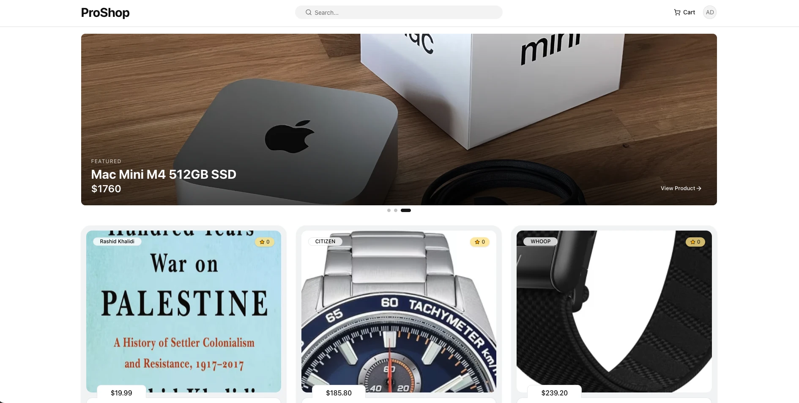
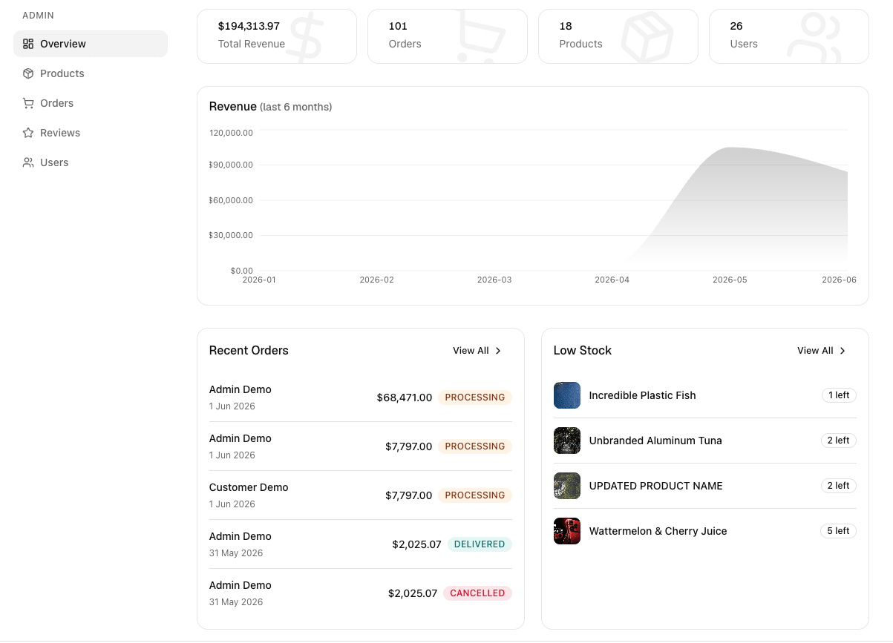
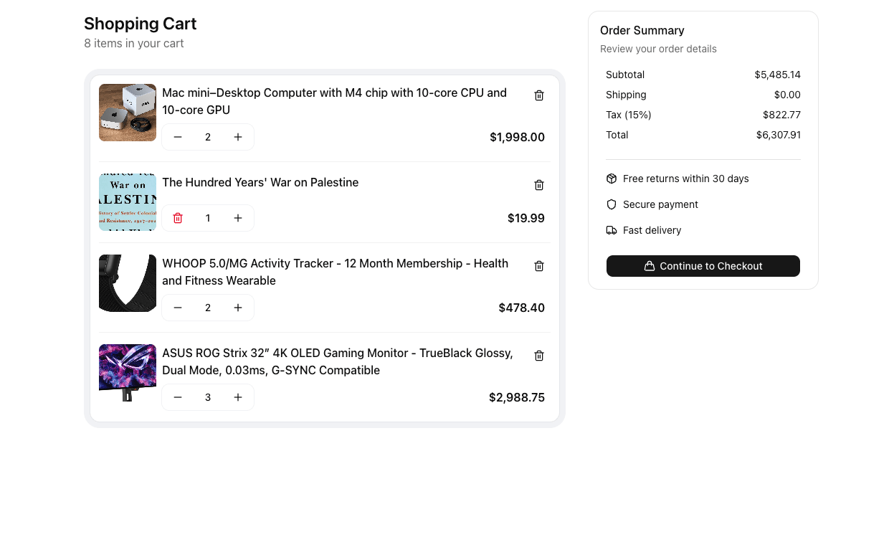
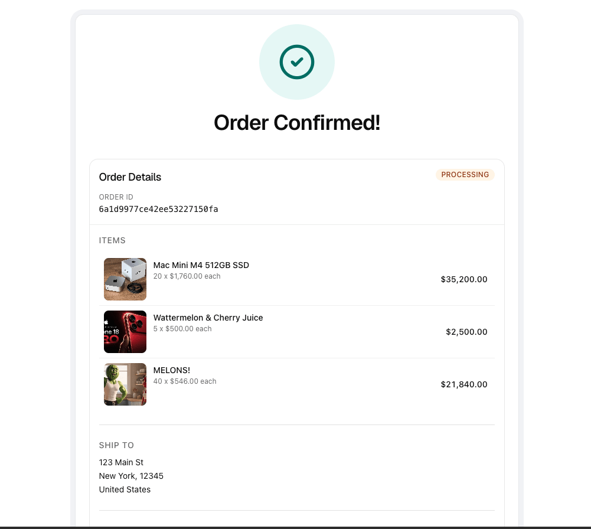
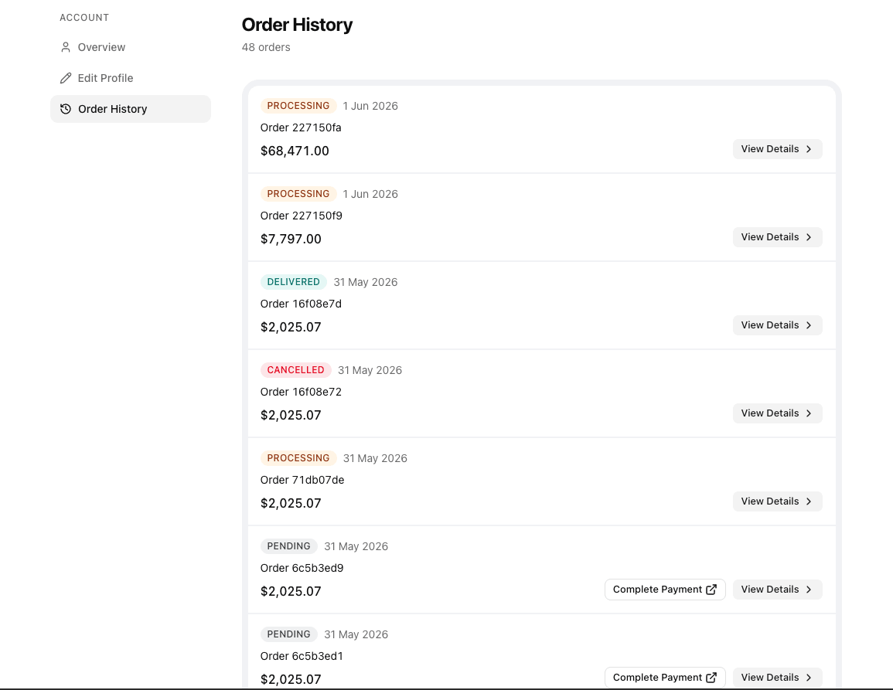
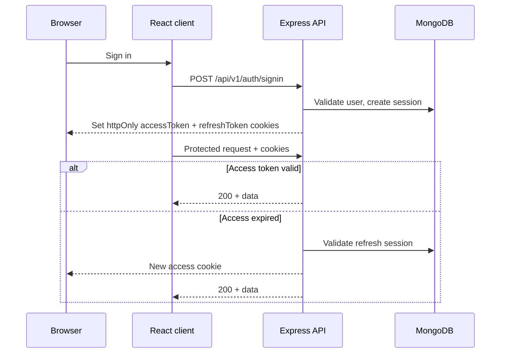
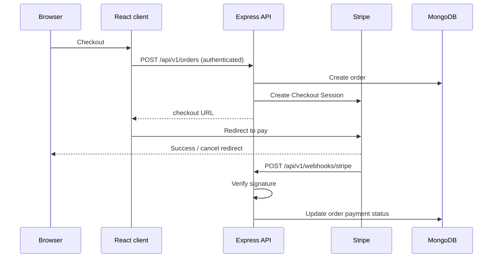

# ProShop

A full-stack TypeScript e-commerce app built to demonstrate production-grade
architecture, secure auth, Stripe payments, and a layered REST API.

**Live demo:** [proshop.moh-sa.dev](https://proshop.moh-sa.dev) · **Portfolio:**
[moh-sa.dev](https://moh-sa.dev) · **LinkedIn:**
[linkedin.com/in/moh-sa](https://linkedin.com/in/moh-sa)

## Screenshots



<details>
<summary>More screenshots</summary>


 



</details>

## Features

- Product catalog with search and product detail pages.
- Shopping cart and Stripe Checkout with webhook-driven order status updates.
- User accounts: registration, sign-in, profile management, and order history.
- Product reviews with user-owned create, edit, and delete per product.
- Admin panel: manage products, orders, users, and reviews. Stats dashboard.
- Cookie-based auth with httpOnly access and refresh JWTs backed by server-side
  sessions.
- Demo sign-in page includes one-click login as customer or admin. No account
  creation needed.
- REST API at `/api/v1` with role-based access control (user and admin roles).
- Error monitoring via Sentry on both client and server.

## Engineering highlights

- **Auth:** httpOnly cookies for access and refresh JWTs. Refresh tokens backed
  by MongoDB sessions. Argon2 password hashing. Rate-limited auth routes.
- **Payments:** Orders created on the server. Stripe Checkout session. Webhooks
  verify signatures and update order status.
- **API design:** Layered architecture — Routers → Controllers → Managers →
  Services → Repositories. Zod validation. Centralized error handling and
  middleware chains (`userGuard`, `adminGuard`).
- **Caching:** Custom in-memory caching service (`node-cache`) used for product
  queries and rate limiting. Zod-validated inputs and memory capacity guards.
- **Security:** Helmet, CORS with credentials, mongo sanitization, signed
  cookies.
- **Frontend:** File-based TanStack Router with authenticated and admin layouts.
  React Query for server state. Optimistic updates where appropriate.
- **Testing:** 1,589 tests (1,036 unit, 553 integration) with 96% line coverage.
- **Observability:** Structured logging (Pino), Sentry on both apps.

## Tech stack

| Layer             | Technologies                                                                      |
| ----------------- | --------------------------------------------------------------------------------- |
| **Frontend**      | React 19, Vite, TypeScript, TanStack Router & Query, Tailwind CSS, Zustand, Axios |
| **Backend**       | Node.js, Express, TypeScript, Mongoose, Zod                                       |
| **Data**          | MongoDB                                                                           |
| **Payments**      | Stripe (Checkout + webhooks)                                                      |
| **Media**         | Cloudinary                                                                        |
| **Observability** | Sentry, Pino                                                                      |

## Architecture

### Auth and session flow



### Order and Stripe flow



## Quick start

**Prerequisites:** Node.js 22+, pnpm 10+, MongoDB,
[Stripe CLI](https://stripe.com/docs/stripe-cli), and accounts for Stripe,
Cloudinary, and Sentry.

```bash
# Terminal 1 — API (default: http://localhost:5000)
cd server && pnpm install && cp .env.example .env
pnpm dev

# Terminal 2 — Stripe webhook forwarding
stripe listen --forward-to http://localhost:5000/api/v1/webhooks/stripe

# Terminal 3 — Client (default: https://localhost:5173)
cd client && pnpm install && cp .env.example .env
pnpm dev

# Run server tests
cd server && pnpm test
```

**Stripe webhooks:** Run `stripe listen` once first to get your webhook signing
secret, then set `STRIPE_WEBHOOK_SECRET` in `server/.env` and restart the API.

Fill in all remaining values in each `.env` file. Both `.env.example` files
document every required variable.
