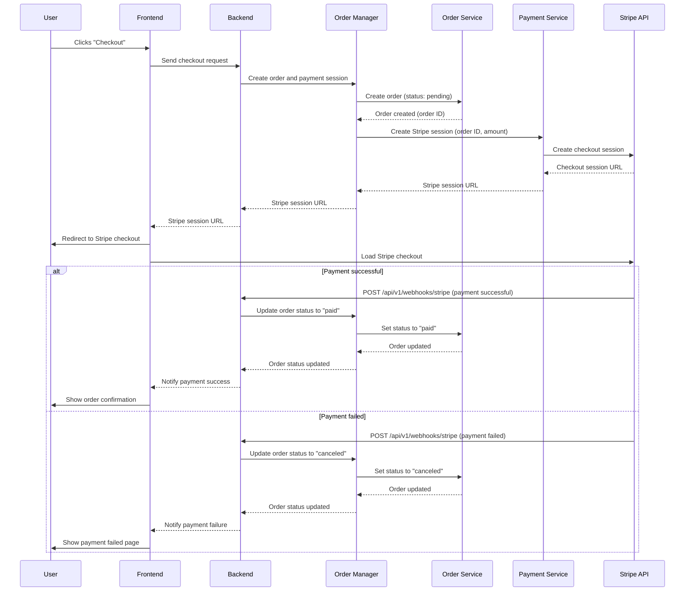

 

  <h3 align="center">ProShop</h3>
  

    A MERN eCommerce project based on Brad Traversy's course.
  

## Demo
  **URL**: https://proshop.moh-sa.dev
  
  
## Built With

**Client**: ReactJS, Axios, bootstrap, react-router, redux, and PayPal SDK.

**Server**: ExpressJs, Mongoose, JWT, morgan, Multer, express-async-handler, cors, bcrypt, and dontenv.

## Order Creation and Payment Flow

